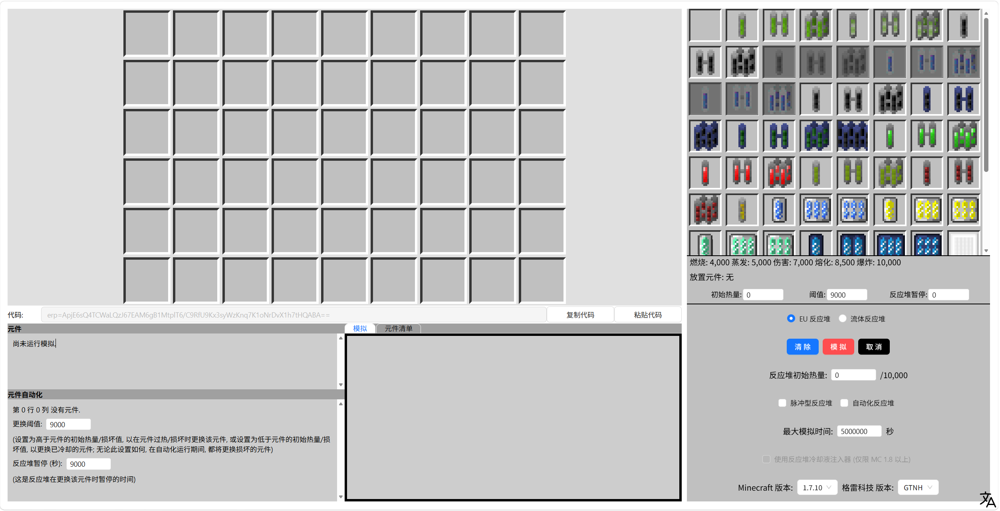
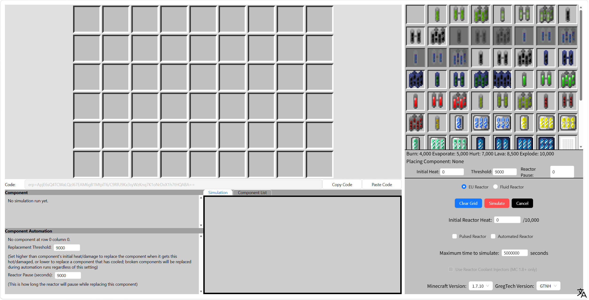

# GTNH Reactor Simulator (React)

[中文](#中文说明) | [English](#english)



---

## 中文说明

### 项目简介

这是一个基于 React + TypeScript + Vite 的 GTNH 反应堆模拟器前端项目。

### 环境要求

- Node.js
- npm

### 安装与启动

```bash
npm ci
npm run dev
```

启动后按终端提示在浏览器打开本地地址 `http://localhost:xxx`。你可以通过右下角的语言切换按钮在中文和英文界面之间切换。

## English

### Overview

This is a GTNH reactor simulator frontend built with React + TypeScript + Vite.

### Requirements

- Node.js
- npm

### Install and Run

```bash
npm ci
npm run dev
```

Then open the local URL（like `http://localhost:xxx`） printed in terminal with your browser. You can switch between Chinese and English interfaces using the language toggle button at the bottom right corner.
